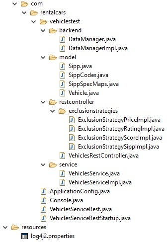
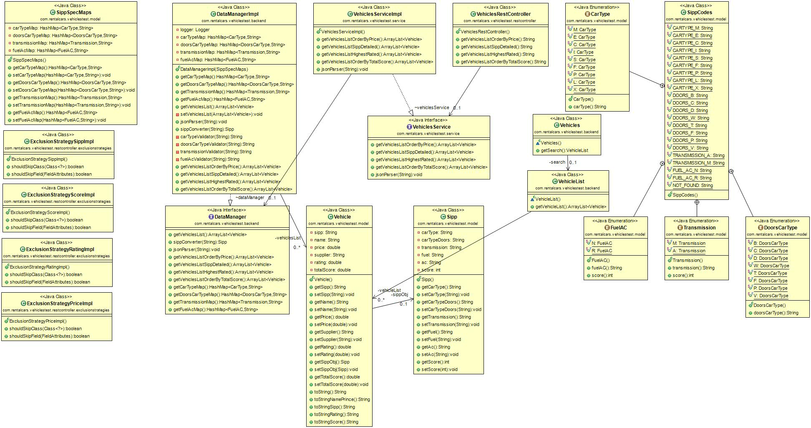

# Vehicles Simple Service Rest

###  Architecture
The implementation of this solution is based on a service interface that provides the features requested. The back-end is based on a data manager interface accessible from the service implementation. 

#####  Assumptions
###### SIPP table
All the informations are loaded into a set of HashMaps collected into the SippSpecMaps object.

###### SIPP calculator
The method SippConverter Converts the sipp String verifying the correctness of the data 
In case of IllegalArgumentException (Character not recognized for a correct translation), 
The assumption is to load the value SippCodes.NOT_FOUND. The other informations are displayed
anyway.

##### Framework
The framework used is Spring, configured using ApplicationConfig and annotations.
For the Rest API implementation I use Spring Boot, extendig the code provided with a Rest Controller.

##### Service layer
The Service interface "VehiclesSimpleService" provides the methods:

	public ArrayList<Vehicle> getVehiclesListOrderByPrice() throws Exception;
	
	public ArrayList<Vehicle> getVehiclesListSippDetailed() throws Exception;
	
	public ArrayList<Vehicle> getVehiclesListHighestRated() throws Exception;	
	
	public ArrayList<Vehicle> getVehiclesListOrderByTotalScore() throws Exception;
	
	public void jsonParser(String path);
	

##### Data layer
 The interface "DataManager" provides the data management:
	public ArrayList<Vehicle> getVehiclesList();

	public Sipp sippConverter(String sipp) throws Exception;

	public void jsonParser(String path);

	public ArrayList<Vehicle> getVehiclesListOrderByPrice();

	public ArrayList<Vehicle> getVehiclesListSippDetailed() throws Exception;

	public ArrayList<Vehicle> getVehiclesListHighestRated() throws Exception;	

	public ArrayList<Vehicle> getVehiclesListOrderByTotalScore();

	public HashMap<SippCodes.CarType, String> getCarTypeMap();

	public HashMap<SippCodes.DoorsCarType, String> getDoorsCarTypeMap();

	public HashMap<SippCodes.Transmission, String> getTransmissionMap();

	public HashMap<SippCodes.FuelAC, String> getFuelAcMap();

----------

##### Project Structure


----------

##### Class diagram


----------

###  Library used

	<dependencies>
		<!-- https://mvnrepository.com/artifact/org.springframework.boot/spring-boot-starter-web -->
		<dependency>
			<groupId>org.springframework.boot</groupId>
			<artifactId>spring-boot-starter-web</artifactId>
		</dependency>
		<!-- https://mvnrepository.com/artifact/org.springframework.boot/spring-boot-starter-actuator -->
		<dependency>
			<groupId>org.springframework.boot</groupId>
			<artifactId>spring-boot-starter-actuator</artifactId>
		</dependency>
		<!-- https://mvnrepository.com/artifact/org.springframework.boot/spring-boot-starter-test -->
		<dependency>
			<groupId>org.springframework.boot</groupId>
			<artifactId>spring-boot-starter-test</artifactId>
		</dependency>
		<!-- https://mvnrepository.com/artifact/junit/junit -->
		<dependency>
			<groupId>junit</groupId>
			<artifactId>junit</artifactId>
		</dependency>
		<!-- https://mvnrepository.com/artifact/com.googlecode.json-simple/json-simple -->
		<dependency>
			<groupId>com.googlecode.json-simple</groupId>
			<artifactId>json-simple</artifactId>
		</dependency>
		<!-- https://mvnrepository.com/artifact/com.google.code.gson/gson -->
		<dependency>
			<groupId>com.google.code.gson</groupId>
			<artifactId>gson</artifactId>
		</dependency>
		<!-- https://mvnrepository.com/artifact/org.apache.logging.log4j/log4j-core -->
		<dependency>
			<groupId>org.apache.logging.log4j</groupId>
			<artifactId>log4j-api</artifactId>
		</dependency>
		<dependency>
			<groupId>org.apache.logging.log4j</groupId>
			<artifactId>log4j-core</artifactId>
		</dependency>
	</dependencies>

###  Execution
VehiclesSimpleServiceTest is a maven project, you can import into Eclipse as a maven project.

###  Execution Part 1
Using the command
```
maven clean install
```
maven will compile and will execute the tests.

To view the solution requested I provided a Main Class "Console.java" executable 

###  Execution Part 2

I provide a Executable class VehiclesServiceRest which is a @SpringBootApplication.

is possible to view the REST output using the followings urls:

http://localhost:8080/vehicles/getVehiclesOrderByPrice
http://localhost:8080/vehicles/getVehiclesListSippDetailed
http://localhost:8080/vehicles/getVehiclesListHighestRated
http://localhost:8080/vehicles/getVehiclesListOrderByTotalScore

----------
> **Note:** The version of Java is 1.7 
----------

###  Documentation
[JavaDoc](https://github.com/fabriziozandonella/vehicles-simple-service-rest/tree/master/VehiclesSimpleServiceRest/doc) 

----------

